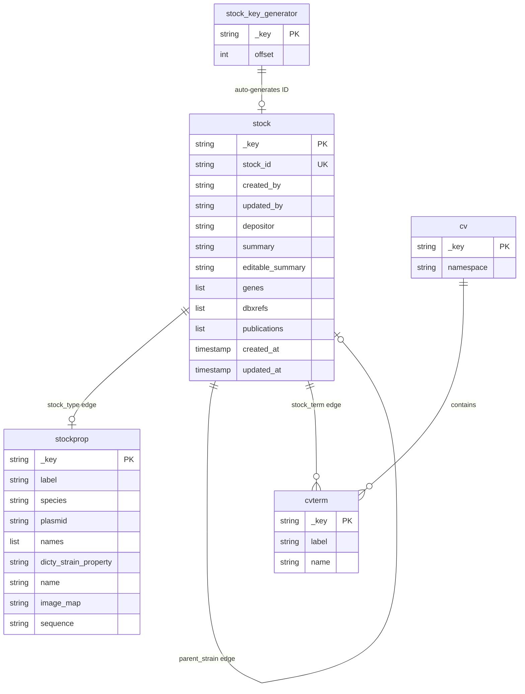

# modware-stock
[](LICENSE)  

[](https://codecov.io/gh/dictyBase/modware-stock)
[](https://codeclimate.com/github/dictyBase/modware-stock/maintainability)   
   
[](https://reporter.nih.gov/project-details/10024726)

gRPC microservice for managing biological stocks (strains and plasmids) in dictyBase. Backed by ArangoDB.

On every create, update, or delete mutation the service publishes a protobuf-serialized event to NATS so that downstream services can react without polling.

- [Running the Server](#running-the-server)
  - [Core Flags](#core-flags)
  - [ArangoDB Collection Flags](#arangodb-collection-flags)
  - [Ontology Flags](#ontology-flags)
- [Stock IDs](#stock-ids)
- [NATS Events](#nats-events)
- [gRPC API](#grpc-api)
  - [Service Methods](#service-methods)
  - [Connect with Go](#connect-with-go)
  - [Create a Strain](#create-a-strain)
  - [Get a Strain](#get-a-strain)
  - [Update a Strain](#update-a-strain)
  - [Update a Plasmid](#update-a-plasmid)
  - [List Strains with Pagination and Filters](#list-strains-with-pagination-and-filters)
  - [Filtering](#filtering)
  - [Batch Lookup by IDs](#batch-lookup-by-ids)
  - [Create a Plasmid](#create-a-plasmid)
  - [Delete a Stock](#delete-a-stock)
  - [Load with Existing ID](#load-with-existing-id)
- [ArangoDB Schema](#arangodb-schema)

## Running the Server

```bash
modware-stock start-server \
  --port 9560 \
  --arangodb-database dictybase \
  --arangodb-user root \
  --arangodb-pass secret \
  --arangodb-host arangodb \
  --arangodb-port 8529 \
  --nats-host nats \
  --nats-port 4222
```

### Core Flags

| Flag | Default | Env Variable | Description |
|------|---------|--------------|-------------|
| `--port` | `9560` | — | gRPC server listen port |
| `--arangodb-database, --db` | `stock` | `ARANGODB_DATABASE` | ArangoDB database name |
| `--arangodb-user` | — | `ARANGODB_USER` | ArangoDB user |
| `--arangodb-pass` | — | `ARANGODB_PASS` | ArangoDB password |
| `--arangodb-host` | `arangodb` | `ARANGODB_SERVICE_HOST` | ArangoDB host |
| `--arangodb-port` | `8529` | `ARANGODB_SERVICE_PORT` | ArangoDB port |
| `--is-secure` | `false` | — | Use TLS for ArangoDB |
| `--nats-host` | — | `NATS_SERVICE_HOST` | NATS host |
| `--nats-port` | — | `NATS_SERVICE_PORT` | NATS port |
| `--reflection, --ref` | `true` | — | Enable gRPC server reflection |
| `--keyoffset` | `370000` | — | Starting offset for auto-generated stock IDs |

Global flags: `--log-format` (`json`/`text`, default `json`), `--log-level` (`debug`/`warn`/`error`/`fatal`/`panic`, default `error`).

### ArangoDB Collection Flags

These flags control the names of collections and graphs created in ArangoDB. Defaults match the dictyBase production configuration.

| Flag | Default | Description |
|------|---------|-------------|
| `--stock-collection` | `stock` | Document collection for all stocks |
| `--stockprop-collection` | `stockprop` | Document collection for stock properties (type-specific fields) |
| `--stock-key-generator-collection` | `stock_key_generator` | Autoincrement collection used to generate stock IDs |
| `--stock-type-edge` | `stock_type` | Edge collection linking a stock to its `stockprop` document |
| `--parent-strain-edge` | `parent_strain` | Edge collection linking a strain to its parent strain |
| `--stock-term-edge` | `stock_term` | Edge collection linking a stock to an ontology term |
| `--stockproptype-graph` | `stockprop_type` | Named graph over `stock_type` edges |
| `--strain2parent-graph` | `strain2parent` | Named graph over `parent_strain` edges |
| `--stockonto-graph` | `stockonto` | Named graph over `stock_term` edges |

### Ontology Flags

These flags configure which ontologies are used to classify and tag stocks. The referenced ontologies must be loaded into ArangoDB before the service starts (see `OboJSONFileUpload`).

| Flag | Default | Description |
|------|---------|-------------|
| `--strain-ontology` | `dicty_strain_property` | Ontology namespace used to group strains |
| `--strain-term` | `general strain` | Default ontology term applied when creating a strain without an explicit `dicty_strain_property` |
| `--plasmid-ontology` | `plasmid_keywords` | Ontology namespace used to group plasmids |
| `--plasmid-term` | `vector` | Default ontology term applied when creating a plasmid without an explicit `dicty_plasmid_property` |

## Stock IDs

Auto-generated IDs follow the pattern `DB(S|P)[0-9]{5,}`:

- **Strains**: `DBS0370001`, `DBS0370002`, … (prefix `DBS`)
- **Plasmids**: `DBP0370001`, `DBP0370002`, … (prefix `DBP`)

The numeric suffix is generated by ArangoDB's autoincrement key generator, seeded by `--keyoffset` (default `370000`). IDs assigned by `LoadStrain`/`LoadPlasmid` must match the same regex; the service validates them before persisting.

## NATS Events

The service publishes events after every mutating operation. Payloads are protobuf-serialized `Strain` or `Plasmid` messages.

| Operation | NATS Subject | Payload |
|-----------|-------------|---------|
| Create strain / plasmid | `StockService.Create` | `Strain` or `Plasmid` |
| Update strain / plasmid | `StockService.Update` | `Strain` or `Plasmid` |
| Delete any stock | `StockService.Delete` | `Strain` or `Plasmid` |

Deserialize using `proto.Unmarshal` with the generated types from `github.com/dictyBase/go-genproto/dictybaseapis/stock`.

## gRPC API

Full protobuf definitions: [dictybaseapis/stock.proto](https://github.com/dictyBase/dictybaseapis/blob/master/dictybase/stock/stock.proto).

### Service Methods

| Method | Request | Response | Description |
|--------|---------|----------|-------------|
| `GetStrain` | `StockId` | `Strain` | Retrieve a strain by ID |
| `CreateStrain` | `NewStrain` | `Strain` | Create a new strain |
| `LoadStrain` | `ExistingStrain` | `Strain` | Load a strain with a pre-assigned ID and timestamps |
| `UpdateStrain` | `StrainUpdate` | `Strain` | Update an existing strain |
| `ListStrains` | `StockParameters` | `StrainCollection` | Paginated strain listing with filters |
| `ListStrainsByIds` | `StockIdList` | `StrainList` | Batch lookup by IDs, no pagination metadata |
| `GetPlasmid` | `StockId` | `Plasmid` | Retrieve a plasmid by ID |
| `CreatePlasmid` | `NewPlasmid` | `Plasmid` | Create a new plasmid |
| `LoadPlasmid` | `ExistingPlasmid` | `Plasmid` | Load a plasmid with a pre-assigned ID and timestamps |
| `UpdatePlasmid` | `PlasmidUpdate` | `Plasmid` | Update an existing plasmid |
| `ListPlasmids` | `StockParameters` | `PlasmidCollection` | Paginated plasmid listing with filters |
| `RemoveStock` | `StockId` | `Empty` | Delete a stock (strain or plasmid) by ID |
| `OboJSONFileUpload` | `stream FileUploadRequest` | `FileUploadResponse` | Stream-upload an OBO JSON ontology file to populate the ontology collections |

### Connect with Go

```go
import (
    "context"
    "log"

    "github.com/dictyBase/go-genproto/dictybaseapis/stock"
    "google.golang.org/grpc"
    "google.golang.org/grpc/credentials/insecure"
)

func main() {
    conn, err := grpc.NewClient(
        "localhost:9560",
        grpc.WithTransportCredentials(insecure.NewCredentials()),
    )
    if err != nil {
        log.Fatal(err)
    }
    defer conn.Close()

    client := stock.NewStockServiceClient(conn)
    ctx := context.Background()
    _ = client // use client methods below
}
```

### Create a Strain

`created_by`, `updated_by`, `depositor`, `label`, and `species` are required. All other fields are optional.

```go
resp, err := client.CreateStrain(ctx, &stock.NewStrain{
    Data: &stock.NewStrain_Data{
        Type: "strain",
        Attributes: &stock.NewStrainAttributes{
            CreatedBy: "user@dictybase.org",
            UpdatedBy: "user@dictybase.org",
            Depositor: "Jane Doe",
            Label:     "DBS0123456",
            Species:   "Dictyostelium discoideum",
            Genes:     []string{"gene1"},
            Names:     []string{"myStrain"},
        },
    },
})
// resp.Data.Id — auto-generated ID (e.g. "DBS0370001")
// resp.Data.Attributes.DictyStrainProperty — defaults to the server's --strain-term value if omitted
```

### Get a Strain

```go
resp, err := client.GetStrain(ctx, &stock.StockId{Id: "DBS0350123"})
```

### Update a Strain

Only `updated_by` is required. All other attributes are optional; unset fields are left unchanged.

```go
resp, err := client.UpdateStrain(ctx, &stock.StrainUpdate{
    Data: &stock.StrainUpdate_Data{
        Type: "strain",
        Id:   "DBS0350123",
        Attributes: &stock.StrainUpdateAttributes{
            UpdatedBy:           "user@dictybase.org",
            Summary:             "Updated description",
            DictyStrainProperty: "REMI-seq",
        },
    },
})
```

### Update a Plasmid

Only `updated_by` is required. All other attributes are optional.

```go
resp, err := client.UpdatePlasmid(ctx, &stock.PlasmidUpdate{
    Data: &stock.PlasmidUpdate_Data{
        Type: "plasmid",
        Id:   "DBP0350456",
        Attributes: &stock.PlasmidUpdateAttributes{
            UpdatedBy: "user@dictybase.org",
            Summary:   "Updated plasmid description",
            Sequence:  "ATCG...",
        },
    },
})
```

### List Strains with Pagination and Filters

`ListStrains` and `ListPlasmids` use cursor-based pagination. The default page size is 10.

```go
resp, err := client.ListStrains(ctx, &stock.StockParameters{
    Limit:  10,
    Cursor: 0,
    Filter: "depositor===Jane Doe",
})
// resp.Data           — slice of strains for this page
// resp.Meta.NextCursor — pass as Cursor to retrieve the next page (0 means last page)
// resp.Meta.Total      — total number of records matching the filter
// resp.Meta.Limit      — the effective page size

// Fetch the next page
if resp.Meta.NextCursor != 0 {
    next, err := client.ListStrains(ctx, &stock.StockParameters{
        Limit:  10,
        Cursor: resp.Meta.NextCursor,
        Filter: "depositor===Jane Doe",
    })
}
```

### Filtering

`ListStrains` and `ListPlasmids` accept a `filter` string in `StockParameters`. Filters follow the syntax `field operator value` and can be combined with boolean connectors.

#### Boolean Connectors

| Symbol | Meaning | Precedence |
|--------|---------|------------|
| `;` | AND | Higher |
| `,` | OR | Lower |

AND takes precedence over OR. Use `;` and `,` to build compound expressions without parentheses.

#### String Operators

| Operator | Meaning |
|----------|---------|
| `===` | Equals |
| `!==` | Not equals |
| `=~` | Contains substring |
| `!~` | Does not contain substring |

#### Date Operators

Date values accept `YYYY-MM-DD`, `YYYY-MM`, or `YYYY` formats.

| Operator | Meaning |
|----------|---------|
| `$==` | Equals |
| `$>` | After |
| `$<` | Before |
| `$>=` | On or after |
| `$<=` | On or before |

#### Array Operators

Used for fields that hold repeated values (e.g. `gene`, `name`).

| Operator | Meaning |
|----------|---------|
| `@==` | Element equals |
| `@!=` | Element not equals |
| `@=~` | Element contains substring |
| `@!~` | Element does not contain substring |

#### Filterable Fields

| Filter Key | Type | Applies To | Notes |
|------------|------|------------|-------|
| `id` | string | Strains, Plasmids | |
| `created_at` | date | Strains, Plasmids | Use date operators |
| `updated_at` | date | Strains, Plasmids | Use date operators |
| `depositor` | string | Strains, Plasmids | |
| `summary` | string | Strains, Plasmids | |
| `gene` | array | Strains, Plasmids | Use array operators |
| `species` | string | Strains | |
| `label` | string | Strains | The strain descriptor field |
| `name` | array | Strains | Searches the `names` repeated field; use array operators |
| `parent` | string | Strains | |
| `plasmid` | string | Strains | Related plasmid name |
| `plasmid_name` | string | Plasmids | |
| `ontology` | string | Strains, Plasmids | Ontology namespace |
| `tag` | string | Strains, Plasmids | Ontology term label |

#### Examples

```go
// Strains deposited by a specific user, of a particular species
resp, err := client.ListStrains(ctx, &stock.StockParameters{
    Limit:  10,
    Filter: "depositor===Jane Doe;species===Dictyostelium discoideum",
})

// Strains created after a date
resp, err := client.ListStrains(ctx, &stock.StockParameters{
    Limit:  10,
    Filter: "created_at$>=2022-01-01",
})

// Strains associated with a gene (array field)
resp, err := client.ListStrains(ctx, &stock.StockParameters{
    Limit:  10,
    Filter: "gene@==act15",
})

// Plasmids whose name contains "pDM"
resp, err := client.ListPlasmids(ctx, &stock.StockParameters{
    Limit:  10,
    Filter: "plasmid_name=~pDM",
})

// Strains tagged with a specific ontology term
resp, err := client.ListStrains(ctx, &stock.StockParameters{
    Limit:  10,
    Filter: "tag===REMI-seq",
})
```

### Batch Lookup by IDs

`ListStrainsByIds` returns strains for a list of IDs in a single call, without pagination metadata. IDs must match `DB(S|P)[0-9]{5,}`.

```go
resp, err := client.ListStrainsByIds(ctx, &stock.StockIdList{
    Id: []string{"DBS0350123", "DBS0350456"},
})
```

### Create a Plasmid

`created_by`, `updated_by`, `depositor`, and `name` are required.

```go
resp, err := client.CreatePlasmid(ctx, &stock.NewPlasmid{
    Data: &stock.NewPlasmid_Data{
        Type: "plasmid",
        Attributes: &stock.NewPlasmidAttributes{
            CreatedBy: "user@dictybase.org",
            UpdatedBy: "user@dictybase.org",
            Depositor: "Jane Doe",
            Name:      "pDM304",
            Genes:     []string{"act15"},
            Sequence:  "ATCG...",
        },
    },
})
```

### Delete a Stock

`RemoveStock` accepts both strain and plasmid IDs. The operation is idempotent.

```go
_, err := client.RemoveStock(ctx, &stock.StockId{Id: "DBS0350123"})
```

### Load with Existing ID

`LoadStrain` and `LoadPlasmid` are intended for data migration. Unlike `Create*`, they accept a pre-assigned ID and explicit `created_at`/`updated_at` timestamps, preserving historical records without re-sequencing IDs.

```go
resp, err := client.LoadStrain(ctx, &stock.ExistingStrain{
    Data: &stock.ExistingStrain_Data{
        Type: "strain",
        Id:   "DBS0350000",
        Attributes: &stock.ExistingStrainAttributes{
            CreatedBy: "import@dictybase.org",
            UpdatedBy: "import@dictybase.org",
            CreatedAt: timestamppb.New(time.Date(2020, 1, 1, 0, 0, 0, 0, time.UTC)),
            UpdatedAt: timestamppb.New(time.Date(2020, 1, 1, 0, 0, 0, 0, time.UTC)),
            Label:     "DBS0350000",
            Species:   "Dictyostelium discoideum",
            Depositor: "Legacy Import",
        },
    },
})
```

## ArangoDB Schema



The `stock` collection holds fields shared by both strains and plasmids. Type-specific fields (`label`, `species`, `names` for strains; `name`, `sequence`, `image_map` for plasmids) live in a linked `stockprop` document. Ontology classification is stored as graph edges rather than embedded fields, allowing stocks to be queried and grouped by ontology term without denormalizing the data.

Edge collections and their graphs:

| Edge Collection | Graph | From → To | Purpose |
|-----------------|-------|-----------|---------|
| `stock_type` | `stockprop_type` | `stock` → `stockprop` | Links a stock to its type-specific property document |
| `parent_strain` | `strain2parent` | `stock` → `stock` (child → parent) | Records the parental lineage of a strain |
| `stock_term` | `stockonto` | `stock` → `cvterm` | Associates a stock with one or more ontology terms |
